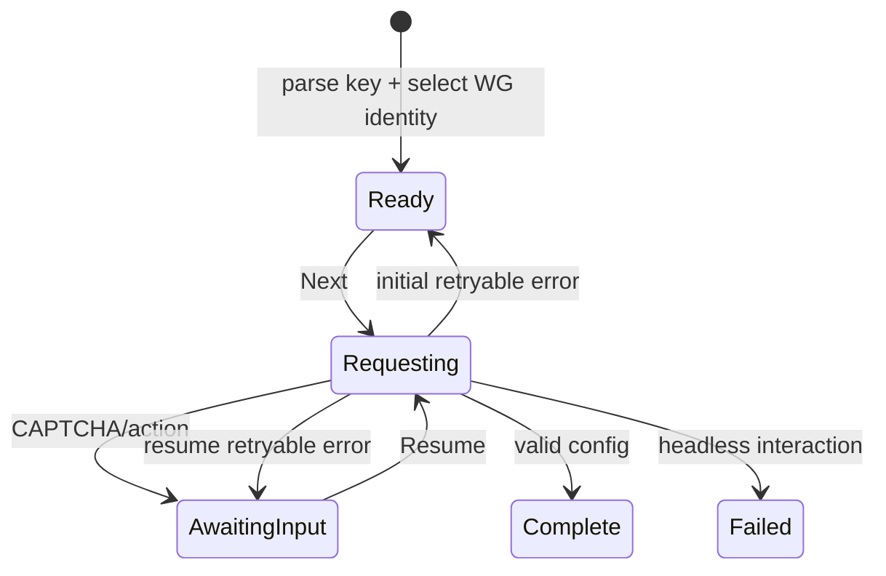

# Architecture and protocol notes

This document specifies the protocol implemented by the
`github.com/asciimoth/wgo/amnesia` subpackage, its public API, security
boundaries, and the evidence used to establish wire compatibility. It covers
API-v2 service keys, self-hosted guest `vpn://` keys, and native
WireGuard/AmneziaWG configs. Service keys request an AWG profile from
`v1/config` and may pause for CAPTCHA; static inputs are projected offline into
the same backend-neutral profile.

All official-source links are pinned to commit
[`7d4f3e0f5090b74903609179653d1f669d2ad08a`](https://github.com/amnezia-vpn/amnezia-client/tree/7d4f3e0f5090b74903609179653d1f669d2ad08a),
the commit attached to official release 5.0.1.5. Pinned links make the protocol
evidence auditable even after upstream changes.

## 1. Scope and trust boundaries

The `amnesia` subpackage owns:

1. bounded `vpn://` framing and input-format detection;
2. API activation-key and self-hosted guest-profile validation;
3. native WireGuard/AWG client-config parsing;
4. caller-owned WireGuard public-key selection, with local X25519 key
   generation as a fallback for service negotiation;
5. gateway request encryption and response decryption;
6. direct-gateway and proxy failover;
7. CAPTCHA negotiation state;
8. profile validation, safe rendering, and backend-neutral projection.

It does not own a default network path. `NewClient` requires a caller-supplied
`http.Client` with an explicit dedicated `RoundTripper`. Gateway requests,
S3-compatible discovery, proxy health checks, and redirects performed by that
client all remain on the caller-selected transport.

It intentionally does not own:

- a WireGuard/AWG tunnel implementation, which is provided by `wgo/device` in
  this repository;
- UI rendering or CAPTCHA acquisition;
- persistent secret storage;
- SSH provisioning or use of self-hosted full-access management keys;
- automatic execution of `send_payload` pre-connect network actions;
- purchase, trial, revoke, account-management, or legacy API-v1 flows.

The gateway, storage objects, proxies, decoded self-hosted documents, and
native configs are all untrusted inputs. Every connection key/config and
completed profile contains or can lead to secret key material.

## 2. End-to-end flow



The diagram describes service-key negotiation. A unified `ImportSession` uses
the same `Ready -> Complete` states for static inputs, but its first `Next`
returns locally without a network request or interaction.

The caller drives every transition. There is no background negotiation and no
goroutine waiting for user input. The same selected public key is kept across
`AwaitingInput`, failed network attempts, and CAPTCHA retries. The preferred
path takes the public key of an existing caller-owned WireGuard node. If none
is supplied, the library generates and retains a fallback keypair.

The official client follows the same pattern: it generates protocol data once,
returns it with the CAPTCHA challenge, and supplies it again during the retry
([key generation and profile extraction](https://github.com/amnezia-vpn/amnezia-client/blob/7d4f3e0f5090b74903609179653d1f669d2ad08a/client/core/controllers/api/subscriptionController.cpp#L60-L178),
[update and CAPTCHA retry](https://github.com/amnezia-vpn/amnezia-client/blob/7d4f3e0f5090b74903609179653d1f669d2ad08a/client/core/controllers/api/subscriptionController.cpp#L376-L515)).

## 3. Activation-key format

### 3.1 Outer framing

An API-v2 key has the textual shape:

```text
vpn://BASE64URL(00 00 00 ff || ZLIB(JSON))
```

- Base64 is URL-safe; padding may be omitted.
- `00 00 00 ff` is a fixed compatibility marker. Although the official name
  uses “signature”, it is not a cryptographic signature and authenticates
  nothing.
- Compression level 6 is used when encoding.
- Parsers also accept raw JSON, unframed zlib, framed zlib, and padded or
  unpadded standard/URL-safe Base64 for defensive compatibility.
- Encoded and decompressed sizes are bounded to avoid decompression bombs.

The marker and encoder are visible in the official
[`apiUtils.cpp`](https://github.com/amnezia-vpn/amnezia-client/blob/7d4f3e0f5090b74903609179653d1f669d2ad08a/client/core/utils/api/apiUtils.cpp#L15-L20)
and
[`getPremiumV2VpnKey`](https://github.com/amnezia-vpn/amnezia-client/blob/7d4f3e0f5090b74903609179653d1f669d2ad08a/client/core/utils/api/apiUtils.cpp#L195-L241).
The official importer performs Base64/qUncompress decoding and rejects legacy
API-v1 subscriptions
([import path](https://github.com/amnezia-vpn/amnezia-client/blob/7d4f3e0f5090b74903609179653d1f669d2ad08a/client/core/controllers/selfhosted/importController.cpp#L164-L227)).

### 3.2 JSON document

The fields consumed by this module are:

| JSON field | Go field | Meaning | Sensitivity |
|---|---|---|---|
| `name` | `ActivationKey.Name` | display label | usually public |
| `description` | `ActivationKey.Description` | display text | usually public |
| `config_version` | `ConfigVersion` | must be `2` | public |
| `api_config.service_type` | `ServiceType` | service/product selector | public-ish |
| `api_config.service_protocol` | `ServiceProtocol` | must be `awg` | public |
| `api_config.user_country_code` | `UserCountryCode` | proxy/service routing input | personal metadata |
| `auth_data` | `AuthData` | credential object, commonly containing `api_key` | **secret** |

Unknown top-level fields are retained in `ActivationKey.Extra` and survive
`EncodeActivationKey`. Unknown fields are not automatically sent to the API.
The full `vpn://` value must be treated as secret because it embeds
`auth_data`.

API-v1 keys return `ErrLegacyKeyUnsupported`; non-AWG keys return
`ErrUnsupportedProtocol`. This library deliberately does not guess how to
handle a future `config_version`.

### 3.3 Unified input classification

`ParseInput` performs bounded decoding and classifies by structure, not by file
extension or the shared `vpn://` prefix:

| Structural marker | `InputFormat` | Offline result |
|---|---|---|
| `api_config` plus `auth_data` | `InputFormatServiceKey` | validated `ActivationKey` |
| `containers` with a ready `awg`/`wireguard` `last_config` | `InputFormatSelfHostedKey` | validated `Profile` |
| `[Interface]` plus `[Peer]` | `InputFormatNativeConfig` | validated `Profile` |
| legacy top-level `api_endpoint`/`api_key` | — | `ErrLegacyKeyUnsupported` |
| self-hosted `userName` or `password` | — | `ErrSelfHostedManagementKey` |

Detection performs no network access. `Client.StartImport` wraps the parsed
result in an `ImportSession`. A service-key session delegates to
`Negotiation`; a static session completes on its first `Next`. This gives UI
and headless applications one state-machine API without hiding which format
was accepted (`ImportSession.Format`).

### 3.4 Self-hosted guest keys

The self-hosted export is a different use of `vpn://`:

```text
vpn://BASE64URL(BIG_ENDIAN_UNCOMPRESSED_SIZE || ZLIB(JSON))
```

This is Qt `qCompress` framing. Unlike the fixed service-key compatibility
marker, the first four bytes carry the decompressed size. `DecodeVPNPayload`
accepts both forms but enforces its own decompressed-size limit rather than
trusting that prefix.

For guest access, the official export generates a new protocol client over an
SSH session, clears root `userName`, `password`, and `port`, keeps only the
selected container, then compresses the resulting JSON
([guest export](https://github.com/amnezia-vpn/amnezia-client/blob/7d4f3e0f5090b74903609179653d1f669d2ad08a/client/core/controllers/selfhosted/exportController.cpp#L52-L112),
[`vpn://` encoding](https://github.com/amnezia-vpn/amnezia-client/blob/7d4f3e0f5090b74903609179653d1f669d2ad08a/client/core/controllers/selfhosted/exportController.cpp#L370-L373)).
The public documentation likewise describes guest `vpn://` and native AWG
exports ([sharing guide](https://docs.amnezia.org/documentation/instructions/share-connection/)).

The relevant guest structure is:

```text
root
├── description, hostName, dns1, dns2, defaultContainer
└── containers[]
    ├── container
    └── awg | wireguard
        └── last_config  (JSON string containing a client profile)
```

`ParseSelfHostedProfile` reads the embedded client private key, derives its
public key, checks any reported public key, and rejects disagreement between
the structured private key and `[Interface] PrivateKey` in the embedded native
config. It does not contact the server. Both ordinary WireGuard and AmneziaWG
guest profiles use the common `Profile` model.

A full-access export is intentionally different: it retains privileged server
credentials and clears cached client profiles
([full-access export](https://github.com/amnezia-vpn/amnezia-client/blob/7d4f3e0f5090b74903609179653d1f669d2ad08a/client/core/controllers/selfhosted/exportController.cpp#L30-L49)).
Producing a usable peer from it requires the official app's SSH provisioning
and server-management subsystem, not the service gateway protocol. This module
recognizes and rejects it with `ErrSelfHostedManagementKey`; applications
should request a revocable guest export instead of attempting to treat it as a
tunnel profile.

### 3.5 Native WireGuard and AmneziaWG configs

`ParseWireGuardConfig` accepts configuration contents, not a path. It currently
requires exactly one `[Interface]` and one `[Peer]`, derives the client public
key from `PrivateKey`, validates addresses, keys, endpoint, ranges, and AWG
constraints, and retains the original text only in `Profile.NativeConfig`.

Only recognized WireGuard/AWG fields enter the structured profile.
`Profile.ConfigText` renders that safe subset. Shell-capable `wg-quick`
directives such as `PreUp`, `PostUp`, `PreDown`, and `PostDown`, routing policy
such as `Table`, and unknown extensions are never reproduced or executed. A
multi-peer or unsupported-protocol input fails explicitly rather than dropping
parts of the configuration.

## 4. Configuration request

### 4.1 Local protocol identity

`NegotiationOptions.WireGuardPublicKey` is the preferred identity input. It is
a standard padded Base64 encoding of exactly 32 bytes. The library sends that
public key but never requests, stores, or transmits its matching private key.
The completed `Profile.Interface.PrivateKey` is empty; the caller configures
its existing node with the matching private key. This ownership assertion is a
caller responsibility.

If `WireGuardPublicKey` is empty, `Start` / `StartKey` generate a fresh X25519
private key using `crypto/ecdh`. WireGuard uses the same Curve25519 key
representation. Both generated 32-byte values use standard padded Base64. The
private value remains in the negotiation and is inserted into the returned
profile in place of `$WIREGUARD_CLIENT_PRIVATE_KEY`.

Starting a second fallback negotiation creates a second keypair. Resuming one
negotiation never changes either a provided public key or a fallback keypair.

### 4.2 Plain API payload

The request target is `POST {gateway-base}/v1/config`. The JSON object contains:

| Field | Source | Inclusion rule |
|---|---|---|
| `os_version` | `ClientMetadata.OSVersion` | always; defaults to `runtime.GOOS` |
| `app_version` | metadata | always; official compatibility default |
| `cli_name` | metadata | always; official compatibility default |
| `distribution` | metadata | when non-empty |
| `app_language` | metadata | when non-empty |
| `installation_uuid` | metadata | when non-empty; stable persistence recommended |
| `user_country_code` | activation key | when non-empty |
| `server_country_code` | negotiation options | when selecting a server country |
| `service_type` | activation key | always |
| `service_protocol` | activation key | always (`awg`) |
| `public_key` | caller option, otherwise generated keypair | always |
| `auth_data` | activation key | always, as a JSON object |
| `is_connect_event` | options | only when true |
| `captcha_id` | paused challenge | CAPTCHA retry only |
| `captcha_solution` | caller response | CAPTCHA retry only |

`ExtraPayload` permits custom compatible gateways to receive additional
fields. Reserved protocol fields cannot be overridden. Nested values are
caller-owned and must not be mutated while a request is in flight.

The official common metadata is constructed in
[`GatewayPayloadBuilder`](https://github.com/amnezia-vpn/amnezia-client/blob/7d4f3e0f5090b74903609179653d1f669d2ad08a/client/core/utils/api/gatewayPayloadBuilder.cpp#L31-L61),
and the update payload is built in
[`SubscriptionController::updateServiceFromGateway`](https://github.com/amnezia-vpn/amnezia-client/blob/7d4f3e0f5090b74903609179653d1f669d2ad08a/client/core/controllers/api/subscriptionController.cpp#L376-L425).
The official installation UUID is created once and persisted
([source](https://github.com/amnezia-vpn/amnezia-client/blob/7d4f3e0f5090b74903609179653d1f669d2ad08a/client/core/repositories/secureAppSettingsRepository.cpp#L409-L422)).

### 4.3 Encrypted envelope

For each logical request, the client generates:

| Value | Bytes | Use |
|---|---:|---|
| AES key | 32 | AES-256 |
| AES IV field | 32 | first 16 bytes used by CBC/OpenSSL |
| salt | 8 | transmitted for compatibility; currently unused by the cipher |
| request ID | UUID v4 | `X-Client-Request-ID` header |

The key JSON is:

```json
{
  "aes_key": "STANDARD_BASE64_32_BYTES",
  "aes_iv": "STANDARD_BASE64_32_BYTES",
  "aes_salt": "STANDARD_BASE64_8_BYTES"
}
```

It is encrypted with RSA PKCS#1 v1.5 using the configured gateway public key.
The plain API JSON is padded with PKCS#7 and encrypted with AES-256-CBC. The
HTTP body is:

```json
{
  "key_payload": "STANDARD_BASE64_RSA_CIPHERTEXT",
  "api_payload": "STANDARD_BASE64_AES_CIPHERTEXT"
}
```

The request header is `Content-Type: application/json`; the request ID is sent
as `X-Client-Request-ID`. The official construction is in
[`GatewayController::prepareRequest`](https://github.com/amnezia-vpn/amnezia-client/blob/7d4f3e0f5090b74903609179653d1f669d2ad08a/client/core/controllers/gatewayController.cpp#L120-L183).
The AES and RSA primitives are in
[`cryptoUtils.cpp`](https://github.com/amnezia-vpn/amnezia-client/blob/7d4f3e0f5090b74903609179653d1f669d2ad08a/common/crypto/cryptoUtils.cpp#L39-L179).

One envelope is prepared per logical transition. If direct access is blocked,
the exact encrypted bytes, AES material, and request ID are reused at proxy
URLs. This matches the official proxy retry path and prevents one UI action
from accidentally becoming several distinct API operations.

### 4.4 Encrypted response

The normal HTTP response body is raw AES-256-CBC ciphertext, not Base64 and not
a JSON envelope. It uses the request's key and IV. After PKCS#7 unpadding, it
must be a JSON object. The official client also classifies a raw body when
decryption fails, so this library accepts plaintext JSON **only for an error
status**; a plaintext success/profile is rejected.

A successful configuration reply contains a string field named `config` and
may contain `service_info`. The config string is another `vpn://`/qCompress
payload. After decompression and optional private-key placeholder substitution,
the official shape is:

```text
root
└── containers[0]
    └── awg
        └── last_config   (JSON string or compatible object)
```

The client object carries the normal WireGuard values plus AWG parameters.
The official extraction and merge behavior appears in
[`extractServerConfigJsonFromResponse`](https://github.com/amnezia-vpn/amnezia-client/blob/7d4f3e0f5090b74903609179653d1f669d2ad08a/client/core/controllers/api/subscriptionController.cpp#L112-L178).

`ParseGatewayProfile` also accepts AWG fields flattened into the protocol
object and a directly returned client object for compatible custom gateways.
It validates 32-byte WireGuard keys, an interface address, and an endpoint.
The private-key API derives the expected public key and substitutes the local
private key. `ParseGatewayProfileWithPublicKey` instead validates the caller's
public key and leaves `Interface.PrivateKey` empty. Both paths reject a
mismatched echoed public key. A server-supplied `client_priv_key` is ignored;
the gateway therefore cannot substitute tunnel identity.

## 5. CAPTCHA and other interactions

The official gateway uses HTTP/body status `402` for several conditions.
CAPTCHA is identified by `captcha_id`, `captcha_image`,
`rate_limit_exceeded`, `invalid_captcha`, or `refresh_captcha`. The challenge
contains:

| Field | Meaning |
|---|---|
| `captcha_id` | opaque retry identifier |
| `captcha_image` | Base64 image supplied to the UI |
| `hint` | optional display hint |
| `message` | optional server message |

On retry, the caller supplies a solution. ASCII digits and full-width Unicode
digits are normalized exactly as in the official client; if no such digits
exist, trimmed text is sent unchanged
([normalization and challenge extraction](https://github.com/amnezia-vpn/amnezia-client/blob/7d4f3e0f5090b74903609179653d1f669d2ad08a/client/core/controllers/api/subscriptionController.cpp#L32-L59),
[retry payload](https://github.com/amnezia-vpn/amnezia-client/blob/7d4f3e0f5090b74903609179653d1f669d2ad08a/client/core/controllers/api/subscriptionController.cpp#L476-L515)).

An invalid solution or refreshed image can return another interaction step.
Missing fields on a retry inherit the previous challenge where safe.

`PauseOnInteraction` exposes the request without an error. In
`FailOnInteraction`, any CAPTCHA or generic `interaction_required` /
`required_action` response moves the session to `NegotiationFailed` and
returns `InteractionRequiredError`. This is a deliberate fail-closed extension
for headless clients: an unknown interactive action is never silently treated
as success.

## 6. Error mapping

Gateway domain errors are projected into `APIError`:

| Body/HTTP status | Condition | `ErrorCode` |
|---:|---|---|
| 429 | rate limited | `ErrorRateLimited` |
| 409 | config/device limit | `ErrorConfigLimit` |
| 409 | message contains trial already used | `ErrorTrialAlreadyUsed` |
| 404 | known missing account/config/session | `ErrorNotFound` |
| 408 | request timeout | `ErrorTimeout` |
| 501 | client update required | `ErrorUpdateRequired` |
| 422 | exact inactive/expired subscription message | `ErrorSubscriptionExpired` |
| 402 | challenge fields or `rate_limit_exceeded` | `ErrorCaptchaRequired` plus interaction |
| 402 | `invalid_captcha` | `ErrorCaptchaInvalid` plus interaction |
| 402 | `refresh_captcha` | `ErrorCaptchaRefresh` plus interaction |
| 402 | other subscription condition | `ErrorSubscriptionInactive` |
| other >= 300 | generic download failure | `ErrorConfigDownload` |

The official mapping is in
[`apiUtils::checkNetworkReplyErrors`](https://github.com/amnezia-vpn/amnezia-client/blob/7d4f3e0f5090b74903609179653d1f669d2ad08a/client/core/utils/api/apiUtils.cpp#L104-L176).

Network, cancellation, and parse errors do not change the selected identity.
The transition returns to `Ready` or `AwaitingInteraction`, so the caller can
retry deliberately. A domain error is returned as received and should not be
blindly retried.

## 7. Gateway proxy and S3-compatible discovery

### 7.1 When failover is attempted

The direct configured gateway is always tried first. Proxy failover is used
for transport failures, timeouts, undecipherable/blocked responses, HTML, most
server errors, and selected unknown 404/501/422 cases. Known semantic errors
such as 402, 408, 409, update-required 501, and known missing-config 404 do not
fan out to proxies. TLS certificate failures fail immediately instead of being
bypassed.

“Direct” in this section means the configured gateway URL rather than an
alternative gateway-proxy URL. It does not mean a direct socket: the gateway,
S3 object stores, gateway-proxy health checks, and gateway-proxy POSTs all use
the same mandatory caller-supplied `http.Client` and `RoundTripper`. The
library has no secondary dialer or `http.DefaultClient` fallback.

This decision table follows
[`GatewayController::shouldBypassProxy`](https://github.com/amnezia-vpn/amnezia-client/blob/7d4f3e0f5090b74903609179653d1f669d2ad08a/client/core/controllers/gatewayController.cpp#L470-L532).

### 7.2 Storage bases and public-object requirement

The exact production bases bundled by this module are listed in section 10.
Each base denotes a directory-like public HTTP object prefix and must end in
`/`. Discovery is not an S3 API operation: there is no bucket enumeration,
AWS SDK, request signing, access key, or XML response. The client constructs a
complete URL and performs an unauthenticated HTTPS `GET` through the mandatory
caller-supplied HTTP transport. Consequently, every required object must be
publicly readable (or otherwise readable by that injected transport).

The official release stores the primary list in the compile definition
`PROD_S3_ENDPOINT` and the fallback list in `FALLBACK_S3_ENDPOINT`. Each is a
single comma-and-space-separated string; the official client splits on the
literal delimiter `", "`. It independently shuffles the resulting primary and
fallback base lists before constructing object URLs
([definition use and splitting](https://github.com/amnezia-vpn/amnezia-client/blob/7d4f3e0f5090b74903609179653d1f669d2ad08a/client/core/controllers/gatewayController.cpp#L331-L358),
[synchronous equivalent](https://github.com/amnezia-vpn/amnezia-client/blob/7d4f3e0f5090b74903609179653d1f669d2ad08a/client/core/controllers/gatewayController.cpp#L393-L421)).

### 7.3 Required object names

For UTF-8 service type `S` and user-country code `C`, a mirror should publish
both of these objects under every base URL:

| Purpose | Object key |
|---|---|
| service/country-specific | `BASE64URL_NO_PADDING("endpoints-" + S + "-" + C) + ".json"` |
| generic fallback | `endpoints.json` |

The country is `api_config.user_country_code` from the activation key, not the
requested server country. When `S` is empty, only `endpoints.json` is queried.
For `S = "amnezia-free"` and `C = "xx"`, the specific object key is:

```text
ZW5kcG9pbnRzLWFtbmV6aWEtZnJlZS14eA.json
```

Thus the first pinned Amazon mirror is expected to expose, for example:

```text
https://s3.eu-north-1.amazonaws.com/amnezia/ZW5kcG9pbnRzLWFtbmV6aWEtZnJlZS14eA.json
https://s3.eu-north-1.amazonaws.com/amnezia/endpoints.json
```

The exact generic-object URLs formed from all pinned release bases are:

| Storage | Generic object URL |
|---|---|
| Amazon S3 bucket `amnezia` | `https://s3.eu-north-1.amazonaws.com/amnezia/endpoints.json` |
| Google Cloud Storage bucket `lambda-list` | `https://storage.googleapis.com/lambda-list/endpoints.json` |
| Azure account `amnzstrg01`, container `lambda-list` | `https://amnzstrg01.blob.core.windows.net/lambda-list/endpoints.json` |
| Oracle namespace `zrhfyaq6qxvh`, bucket `lambda-list` | `https://objectstorage.eu-zurich-1.oraclecloud.com/n/zrhfyaq6qxvh/b/lambda-list/o/endpoints.json` |
| MWS mirror prefix | `https://storage.mwsapis.ru/lambda-list/endpoints.json` |
| address-based mirror prefix | `https://46.8.209.252/lambda-list/endpoints.json` |

Replace `endpoints.json` in any row with the encoded service/country key for
the corresponding specific object.

Within each independently shuffled group, all service-specific primary URLs
are tried before generic primary URLs, followed by service-specific fallback
URLs and then generic fallback URLs. Each object GET has a three-second
timeout. A non-2xx response, transport error, oversized response, invalid
Base64, decryption error, invalid JSON, invalid URL, or empty list causes the
library to try the next object. The first valid non-empty list wins. The
official construction and iteration are visible in
[`GatewayController::getProxyUrls`](https://github.com/amnezia-vpn/amnezia-client/blob/7d4f3e0f5090b74903609179653d1f669d2ad08a/client/core/controllers/gatewayController.cpp#L383-L467)
and its
[`getProxyUrlsAsync` equivalent](https://github.com/amnezia-vpn/amnezia-client/blob/7d4f3e0f5090b74903609179653d1f669d2ad08a/client/core/controllers/gatewayController.cpp#L608-L658).

### 7.4 Required production object contents

The stored object body is not the JSON array directly. It is text Base64 of
AES-CBC ciphertext, without an outer JSON object. Ignoring optional ASCII
whitespace around the Base64, publishers must produce it as follows:

```text
plain = UTF8(JSON array of proxy base URL strings)
D     = SHA-512(exact gateway public-key PEM bytes)
key   = D[0:32]
iv    = D[32:48]
ciphertext = AES-256-CBC-PKCS7-ENCRYPT(key, iv, plain)
object_body = STANDARD_BASE64(ciphertext)
```

Example decrypted plaintext:

```json
[
  "https://gateway-proxy-1.example.net/",
  "https://gateway-proxy-2.example.net/"
]
```

Every entry must be an `http://` or `https://` gateway base URL. This module
normalizes it, removes query/fragment data, and adds a trailing `/`. The exact
PEM bytes matter—including line endings and the presence or absence of a final
newline—because they are the key-derivation input. A custom
`GatewayPublicKeyPEM` therefore requires mirror objects encrypted from that
same exact PEM byte sequence. The official derivation and JSON-array parsing
are in
[`decryptProxyUrlsPayload` and `readCachedProxyUrls`](https://github.com/amnezia-vpn/amnezia-client/blob/7d4f3e0f5090b74903609179653d1f669d2ad08a/client/core/controllers/gatewayController.cpp#L63-L104).

The official development path is different: `DEV_S3_ENDPOINT` objects are
treated as plaintext JSON rather than encrypted payloads
([branch](https://github.com/amnezia-vpn/amnezia-client/blob/7d4f3e0f5090b74903609179653d1f669d2ad08a/client/core/controllers/gatewayController.cpp#L63-L81)).
This module intentionally implements the production encrypted format for both
official and custom endpoints; it does not implicitly accept plaintext mirror
objects.

### 7.5 Cache and static bootstrap behavior

On a successful dynamic fetch, the original encrypted object—not the
decrypted URL list—is passed to `ProxyCache.Store` under:

```text
service_{serviceType}_country_{country}
```

If every network object fails, the cache is loaded and decrypted/validated
again. `DisableS3Discovery` disables storage network GETs but does not disable
reading a supplied cache. Official persistence uses
`Conf/proxyUrls/{cacheKey}`
([repository implementation](https://github.com/amnezia-vpn/amnezia-client/blob/7d4f3e0f5090b74903609179653d1f669d2ad08a/client/core/repositories/secureAppSettingsRepository.cpp#L309-L324)).

This module additionally appends `StaticProxyURLs` to the dynamic or cached
candidate set, normalizes and deduplicates the union, and shuffles candidates
before health checks. Therefore “static fallback” means a final source of
candidates, not a guarantee that static URLs are tried after every dynamic
URL. Set `StaticProxyURLs` to a non-nil empty slice to disable that module-only
bootstrap list.

### 7.6 Selecting and using a gateway proxy

Proxy URLs are checked with a one-second `GET {proxy}/lmbd-health`. A working
proxy receives the same API path, encrypted request bytes, AES state, and
request ID as the original gateway attempt. A successful proxy is preferred
for later operations on the same `Client`. The official synchronous behavior
is in
[`GatewayController::bypassProxy`](https://github.com/amnezia-vpn/amnezia-client/blob/7d4f3e0f5090b74903609179653d1f669d2ad08a/client/core/controllers/gatewayController.cpp#L535-L605),
with the asynchronous health and replay paths in
[`getProxyUrlAsync` and `bypassProxyAsync`](https://github.com/amnezia-vpn/amnezia-client/blob/7d4f3e0f5090b74903609179653d1f669d2ad08a/client/core/controllers/gatewayController.cpp#L660-L723).

## 8. Profile model and AWG versions

The structured result is not coupled to tunnel startup code:

| Type | Contents |
|---|---|
| `WireGuardInterface` | private/public key, addresses, DNS, MTU, listen port, firewall mark |
| `WireGuardPeer` | server key, PSK, endpoint, allowed IPs, persistent-keepalive range |
| `AmneziaWGConfig` | J/S/H/I values and all AWG 3.1 additions |
| `ProfileAPI` | service selection and opaque `service_info` |
| `PreConnectAction` | unexecuted server-supplied preamble action |

`ProfileAPI` is empty for static imports. A negotiated service profile either
references a caller-owned public key with an empty private-key field or
contains a locally generated fallback private key. For a self-hosted/native
profile, the private key is embedded in the imported secret and validated
locally. The application can use `ImportSession.Format` when persistence or
refresh policy must distinguish these origins.

Recognized AWG fields are:

| Family | Fields |
|---|---|
| legacy junk | `Jc`, `Jmin`, `Jmax` |
| crypto padding | `S1`, `S2`, `S3`, `S4` |
| header ranges | `H1`, `H2`, `H3`, `H4` |
| initiation packets | `I1` through `I5` |
| AWG 3.1 header/content | `HeaderProtectionKey`, `ContentPaddingAddition` |
| AWG 3.1 timings | `RekeyAfterTime`, `RekeyTimeout`, `RejectAfterTime`, `KeepaliveTimeout`, `MaxHandshakeAttempts` |
| AWG 3.1 toggles | `RandomTrailers`, `DisableCookies` |
| peer timing | ranged `PersistentKeepalive` |

If `protocol_version` is absent, version inference matches the official app:
3.1 markers first, then v2 S3/S4 or header ranges, then v1.5 I-packets. The
official field list is in
[`configKeys.h`](https://github.com/amnezia-vpn/amnezia-client/blob/7d4f3e0f5090b74903609179653d1f669d2ad08a/client/core/utils/constants/configKeys.h#L79-L132),
and version detection is in
[`awgProtocolConfig.cpp`](https://github.com/amnezia-vpn/amnezia-client/blob/7d4f3e0f5090b74903609179653d1f669d2ad08a/client/core/models/protocols/awgProtocolConfig.cpp#L20-L64).
The official native template shows placement in `[Interface]` and `[Peer]`
([template](https://github.com/amnezia-vpn/amnezia-client/blob/7d4f3e0f5090b74903609179653d1f669d2ad08a/client/server_scripts/awg/template.conf#L1-L36)).

`Profile.ConfigText` and `RenderConfig` create an amneziawg-tools-style config
from the validated structured model. They return
`ErrWireGuardPrivateKeyRequired` for a caller-owned identity until the caller
sets `Profile.Interface.PrivateKey` to the matching key. Structured backends
can keep that key external. The original server text is retained in
`Profile.NativeConfig` for deliberate compatibility inspection, but is never
returned implicitly: unknown native directives can include commands when fed
to wrappers such as `wg-quick`. Known WireGuard and AWG fields from the native
text are used only as structured fallbacks.

## 9. Pre-connect actions

A profile may contain `send_payload`, an array of endpoint/protocol/timeout and
payload descriptions. The official app supports TCP and UDP, sends the
payload, and optionally compares an exact response before connection
([implementation](https://github.com/amnezia-vpn/amnezia-client/blob/7d4f3e0f5090b74903609179653d1f669d2ad08a/client/core/utils/payloadSender.cpp#L81-L192)).

The tag grammar observed in that implementation is:

| Tag | Meaning |
|---|---|
| `<b 0x0102>` | literal hexadecimal bytes |
| `<r 16>` | 16 cryptographically random bytes in this library |

`BuildTaggedPayload` parses only these forms and rejects unknown/malformed
tags. The official parser skips malformed tags, but fail-closed behavior is
safer for an embeddable library. `Profile.PreConnect` is never executed
automatically because it is server-directed network traffic; the host
application must authorize it.

## 10. Defaults and provenance

### 10.1 Exact pinned production addresses

These are the defaults bundled in this module for official release `5.0.1.5`
(commit `7d4f3e0f5090b74903609179653d1f669d2ad08a`). They are compatibility
snapshots, not a promise that the service will keep them live.

| Role | Exact base address |
|---|---|
| API gateway | `http://gw.amnezia.org:80/` |
| primary storage 1 — Amazon S3 | `https://s3.eu-north-1.amazonaws.com/amnezia/` |
| primary storage 2 — Google Cloud Storage | `https://storage.googleapis.com/lambda-list/` |
| primary storage 3 — Azure Blob Storage | `https://amnzstrg01.blob.core.windows.net/lambda-list/` |
| primary storage 4 — Oracle Object Storage | `https://objectstorage.eu-zurich-1.oraclecloud.com/n/zrhfyaq6qxvh/b/lambda-list/o/` |
| fallback storage 1 — MWS object storage | `https://storage.mwsapis.ru/lambda-list/` |
| fallback storage 2 — address-based mirror | `https://46.8.209.252/lambda-list/` |

All values above are recorded in [`defaults.go`](defaults.go). The direct
gateway is also literal in the official source: lines 19–20 declare
`gatewayEndpoint`, while lines 26–27 allow a stored `Conf/gatewayEndpoint` to
override it
([pinned source](https://github.com/amnezia-vpn/amnezia-client/blob/7d4f3e0f5090b74903609179653d1f669d2ad08a/client/core/repositories/secureAppSettingsRepository.cpp#L19-L28)).

### 10.3 Default sensitivity

Default material is public compatibility/bootstrap data:

| Material | Secret? | Why |
|---|---|---|
| official gateway URL | no | public network address |
| gateway RSA public key | no | encryption public key |
| S3 bases and proxy URLs | no | public bootstrap addresses |
| activation key / `auth_data` | **yes** | authorizes service access |
| self-hosted guest key or native `.conf` | **yes** | embeds tunnel private key and endpoint |
| self-hosted full-access key | **yes, critical** | may embed privileged SSH credentials |
| caller-supplied API credentials | **yes** | authorizes a custom service |
| local/returned WireGuard private key and raw profile | **yes** | tunnel identity |
| AWG `HeaderProtectionKey` | **yes** | shared packet-obfuscation key |
| installation UUID | sensitive metadata | stable client identifier |
| private deployment endpoint | possibly | operational metadata |

Do not confuse the build system's secret injection mechanism with the
cryptographic classification of an RSA public key. Custom service keys and
credentials remain secrets and must never be committed.

## 11. Security caveats

Compatibility preserves several protocol properties that a new design should
not copy:

1. The official default gateway is `http://`, not HTTPS.
2. AES-CBC provides confidentiality but the envelope has no independent MAC or
   AEAD tag. PKCS#7 validity is not response authenticity, and CBC ciphertext
   is malleable.
3. RSA PKCS#1 v1.5 is legacy encryption padding. The library only encrypts with
   a public key and does not expose a decryption oracle.
4. `aes_salt` is generated and transported but not used by the observed
   encryption/decryption path.
5. S3 proxy-list “encryption” derives its key from a public value. It is
   obfuscation, not access control or authentication; HTTPS certificate
   validation is its practical authenticity boundary.
6. A `vpn://` marker is not a signature. Possession of a syntactically valid
   key does not establish its provenance.
7. The profile can direct pre-connect traffic. This library does not execute
   it automatically.
8. A native config can contain executable `wg-quick` hooks. The original text
   is retained as untrusted data, while `ConfigText` renders only known fields.
9. A self-hosted full-access key can contain server-administrator credentials.
   It is rejected and must never be logged merely to explain that rejection.

Applications should prefer a custom HTTPS gateway when available, never
disable TLS verification, bound contexts, avoid secret logging, persist
credentials in platform secret storage, and validate backend configuration
before applying it.

## 12. Code architecture

| File | Responsibility |
|---|---|
| `client.go` | option validation, defaults, metadata, URL normalization, shared client state |
| `defaults.go` | pinned public official bootstrap material |
| `key.go` | `vpn://` framing, bounded decompression, API-v2 model |
| `input.go` | unified detection, self-hosted/native parsing, `ImportSession` facade |
| `crypto.go` | RSA parsing/encryption, AES-CBC, PKCS#7, request envelope |
| `gateway.go` | direct request, decrypt/parse, error and failover decisions |
| `proxy.go` | S3 object discovery, public-key-derived decryption, health checks/cache |
| `negotiation.go` | X25519 keys and resumable interaction state machine |
| `profile.go` | successful config projection, validation, AWG rendering |
| `range.go` | lossless optional ranges and toggles |
| `preconnect.go` | pure tagged-payload construction; no socket I/O |
| `errors.go` | stable error categories and redacted typed errors |

The package uses only the Go standard library. `Client` is concurrency-safe.
Each `Negotiation` serializes transitions with a mutex and permits only one
operation in flight. Secrets are copied where ownership would otherwise be
ambiguous, and `String` methods are deliberately redacted.

## 13. Public API guide

| API | Use |
|---|---|
| `NewClient` | create a reusable client with a mandatory caller-owned HTTP transport |
| `ParseInput` / `ParseInputBytes` | offline detect and parse any supported input |
| `ParseSelfHostedProfile` | parse a ready self-hosted WG/AWG guest key offline |
| `ParseWireGuardConfig` | parse native single-peer WG/AWG contents offline |
| `Client.StartImport` | unified interactive-capable session for every supported input |
| `ImportSession.Format` | distinguish service, self-hosted, and native origin |
| `ImportSession.Next` / `Resume` | uniform immediate-or-negotiated state machine |
| `Client.ImportNonInteractive` | unified one-shot fail-on-interaction import |
| `ParseActivationKey` | offline parse/validate without network access |
| `EncodeActivationKey` | create compatible v2 framing; output is secret |
| `Client.Start` / `StartKey` | create an interactive-capable negotiation |
| `Negotiation.Next` | perform the initial transition |
| `Negotiation.Resume` | submit CAPTCHA/custom interaction input |
| `Negotiation.State` | observe state without exposing secrets |
| `Client.AcquireNonInteractive` | one-shot fail-on-interaction mode |
| `ParseGatewayProfile` | parse a compatible successful profile independently |
| `ParseGatewayProfileWithPublicKey` | parse for a caller-owned public-only identity |
| `Profile.ConfigText` | render the validated safe structured subset |
| `Profile.RenderConfig` | always render from structured fields |
| `BuildTaggedPayload` | construct pre-connect bytes under caller policy |
| `DefaultPrimaryS3URLs` etc. | obtain caller-owned copies of public defaults |

`ClientOptions.HTTPClient` is mandatory. A nil client, nil `Transport`, or the
shared `http.DefaultTransport` is rejected with `ErrHTTPClientRequired` or
`ErrHTTPTransportRequired`. `NewClient` shallow-copies the `http.Client` to pin
its `RoundTripper`; all outbound HTTP paths call that copy's `Do` method.
Transport state remains shared and must be concurrency-safe. Its timeout and
request contexts both apply. The caller owns proxy/DNS, TLS roots, redirect,
and logging policy. Do not install a transport that bypasses the required
proxy, logs bodies, or disables certificate checks.

## 14. Compatibility limits

- Only `config_version == 2` and `service_protocol == "awg"` negotiate.
- Static imports support WireGuard/AmneziaWG guest profiles only. Full-access
  self-hosted SSH management, OpenVPN, Xray/VLESS, and other Amnezia container
  protocols are recognized as out of scope.
- Native WG/AWG input currently requires one interface and one peer; the
  parser rejects multi-peer input to avoid a lossy projection.
- Native `DNS` values must be IP addresses. Search domains and `wg-quick`
  routing/script policy remain application concerns and are not rendered.
- The implemented service call is `v1/config`; revoke, trial, purchases, and
  country/account management are out of scope.
- The official default set is pinned to one verified release, while server
  infrastructure can change independently.
- Static proxies are best-effort fallbacks, not a service guarantee.
- Gateway response objects, optional fields, and `service_info` are not a
  versioned public specification; unknown output is retained only in
  `RawConfig` or opaque `ServiceInfo` where applicable.
- `BuildTaggedPayload` is intentionally stricter than the official parser.
- Pre-connect actions are represented but not run.
- Real-service tests are opt-in because they have side effects and require
  secrets.

The integration and Docker E2E strategy is documented in
[TESTING.md](TESTING.md).

## 15. Test strategy

The hermetic suite provides:

- activation framing/unknown-field/redaction tests;
- exact Qt qCompress self-hosted framing and static AWG/WG guest imports;
- native WG/AWG parsing, redaction, and unsafe-directive filtering;
- AES round-trip and invalid-padding tests;
- a frozen official S3 ciphertext fixture;
- an in-process RSA/AES compatible gateway;
- proof that CAPTCHA resume reuses the same WireGuard public key;
- proof that headless mode returns `ErrInteractionRequired`;
- proof that proxy failover reuses request bytes and request ID;
- race-detector coverage of concurrent-safe code paths.

`testdata/private/activation_keys.txt` and `testdata/private/inputs/` add real
parse fixtures. An explicitly enabled `testdata/private/live_api.json` plus a
separate secret key file adds a live no-interrupt query. The entire
`testdata/private` payload is gitignored, and missing files cause `t.Skip`
rather than failure.
